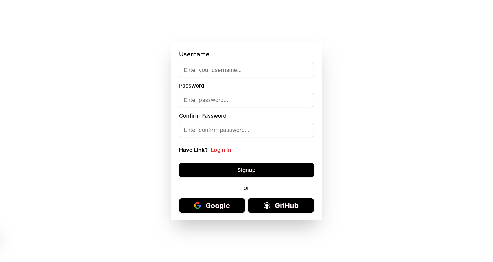
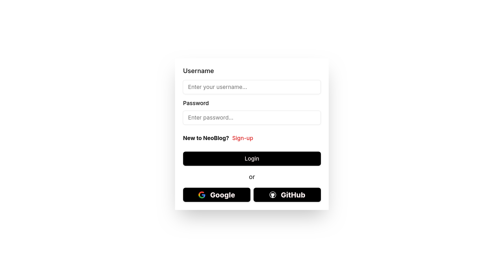
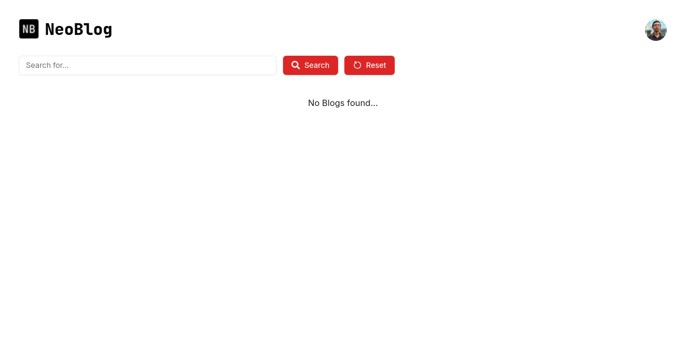
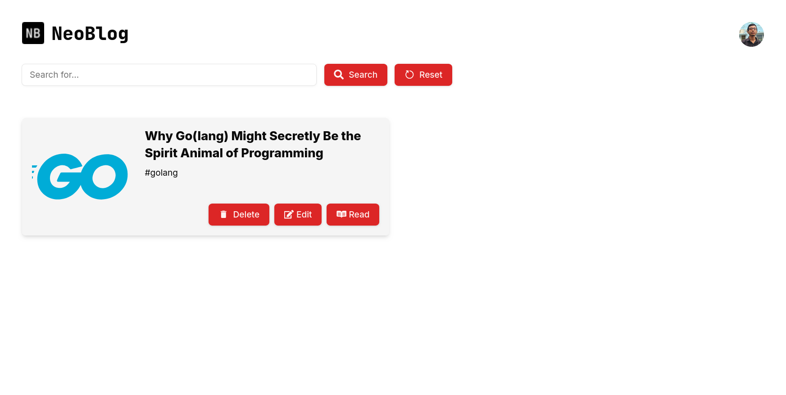
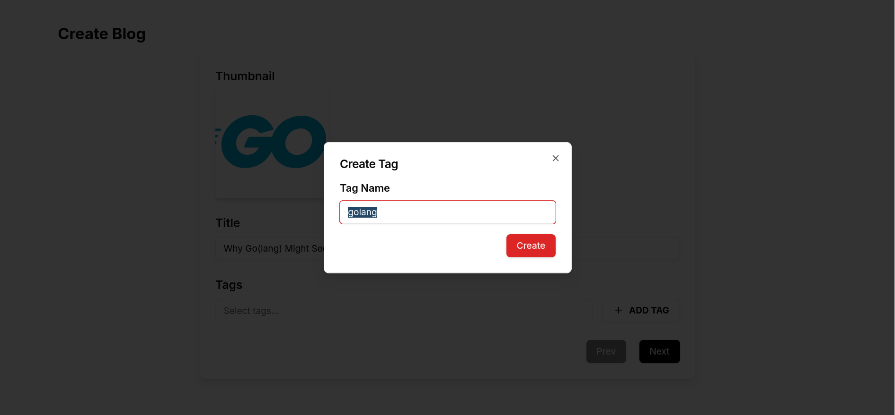
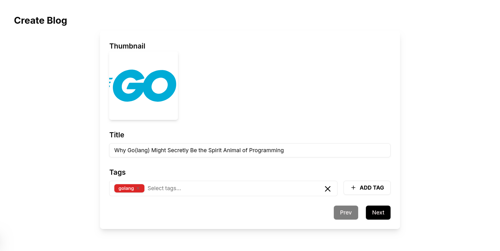
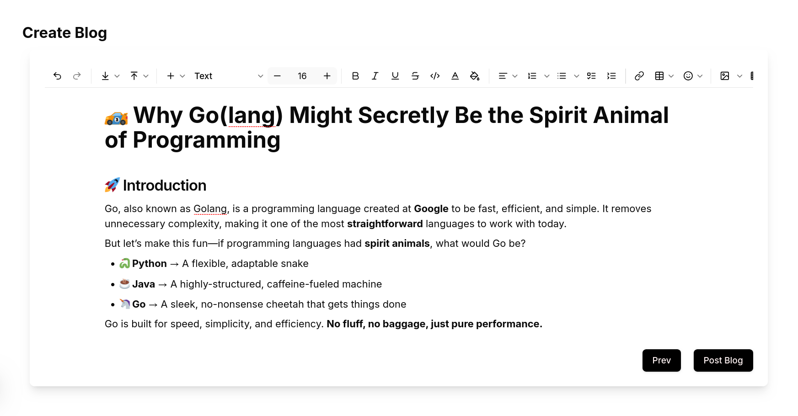
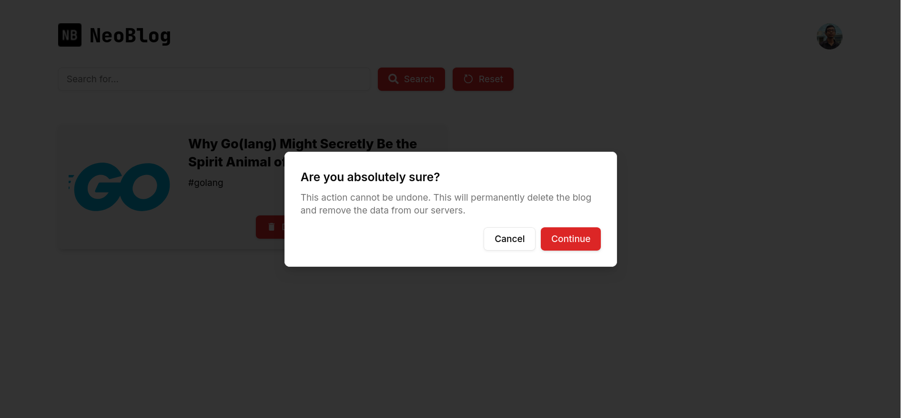
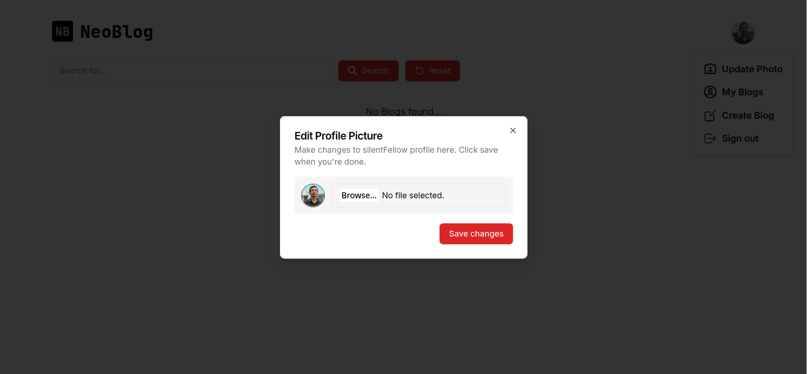

# Neoblog

Neoblog is a simple yet powerful application for creating blogs. It is built using Next.js and includes features such as authentication, pre-built components, and rich text editing.

## Features

- **Next.js**: A React framework for building server-side rendered applications.
- **Next-Auth**: Authentication for users to perform CRUD operations.
- **Shadcn**: Pre-built components for faster development.
- **TailwindCSS**: Utility-first CSS framework for styling.
- **PostgreSQL**: Database for storing user credentials.
- **Drizzle ORM**: ORM for interacting with the PostgreSQL database.
- **Plate.js**: Rich text editor for simple users.
- **Markdown**: Fine-grained control for advanced users.

## Screenshots

Here are some screenshots of the application:

### Sign-up



### Sign-in



### No Blogs Found



### Home with Blogs



### Create Tag



### Create Blog Metadata



### Create Blog Content



### Delete Blog



### Read Blog


### Update Profile



## Getting Started

### Prerequisites

- Node.js
- PostgreSQL

### Installation

1. Clone the repository:

   ```bash
   git clone https://github.com/yourusername/neoblog.git
   cd neoblog
   ```

2. Install dependencies:

   ```bash
   npm install
   ```

3. Set up environment variables:
   Create a `.env.local` file in the root directory and add the following:

   ```env.local
   DATABASE_URL = "your-database-url"
   NEXTAUTH_URL = "your-nextauth-url/http://localhost:3000"
   AUTH_SECRET = "your-auth-secret"
   NEXTAUTH_SECRET = "your-nextauth-secret"
   GITHUB_ID = "your-gihub-id"
   GITHUB_SECRET = "your-github-secret"
   GOOGLE_CLIENT_ID = "your-google-id"
   GOOGLE_CLIENT_SECRET = "your-google-client"
   UPLOADTHING_TOKEN = "your-uploadthing-token"
   ```

4. Run database migrations:

   ```bash
   npx drizzle-kit migrate
   npm run db:generate
   npm run db:migrate
   npm run db:seed # change the usernam and password in ./lib/drizzle/sample/seeding.ts
   ```

### Running the Application

1. Start the development server:

   ```bash
   npm run dev
   ```

2. Open your browser and navigate to `http://localhost:3000`.

## Usage

- Users need to log in with Next-Auth to perform any CRUD operations.
- Simple users can use the Plate.js rich text editor.
- Advanced users can use Markdown for fine-grained control.

## Contributing

Contributions are welcome! Please open an issue or submit a pull request.

## License

This project is licensed under the MIT License.
